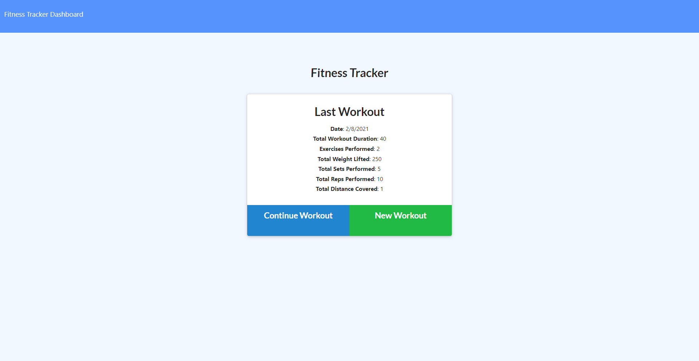
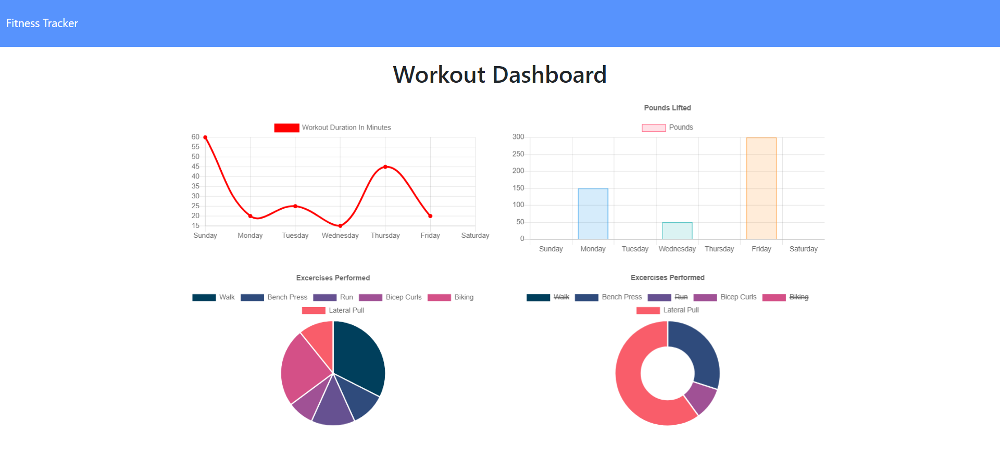

# Workout Tracker

## **Usage**

This app utilizes MongoDB and Mongoose to keep track of your exercises and display graphs of your recent workouts.

## **Description**

This homework assignment had us complete the entire back-end of a workout tracker app. This included setting up the server, database, routes, and connecting everything to the front-end. MongoDB and Mongoose was used for the database and routes. Since the app is hosted on Heroku, MongoDB Atlas was needed to set up that connection.

The user is able to continue a workout to add additional exercises to their most recent workout, or they can start a new workout and add as many exercises as they performed. The user is able to enter either cardio or resistance exercises and each has different data to include. Once some data is input, the user can then view some graphs and charts of the exercises on the dashboard.

## **Challenges**

One of the bigger challenges I had with this assignment was figuring out how to get the total duration of all exercises in a workout calculated and displayed in the "Last Workout" summary. With the front-end code we recieved, everything else was calculating and displaying successfully. For some reason, the total duration returned as undefined. In order to fix this, I needed to aggregate to add a new field to the workout object and name it totalDuration, since that is what the front-end code was looking for.

## **Link**

The app is deployed on Heroku [here](https://workout-tracker-pp.herokuapp.com).

## **Screenshots**

&nbsp;&nbsp;

## **License**

This project uses the MIT license.

## **Questions**

If you have any questions or comments about this repository, please contact me at peter.phenow@gmail.com.

Please visit [peterphenow](https://github.com/peterphenow) to view more of my work.
